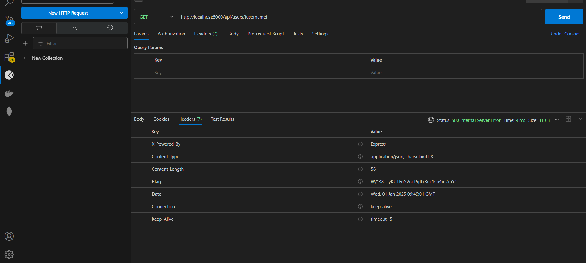
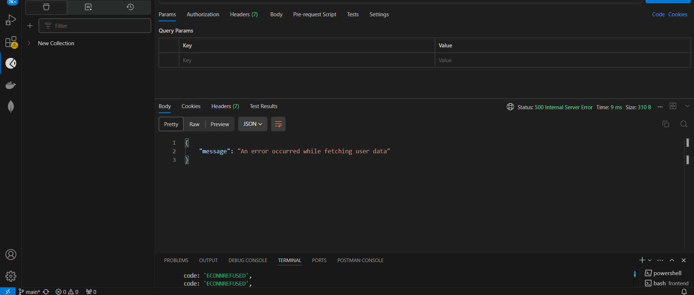
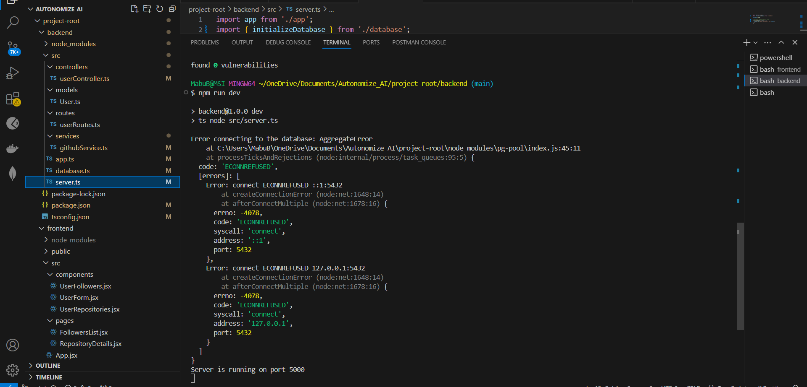

# Here the following Backend code structure as follows :-

Project-root
    backend 
        Src
            controllers
                userController.ts
            modals
                User.ts
            routes
                userRoutes.ts
            services
                githubService.ts
            App.ts
            Server.ts
            Database.ts
        package-lock.json
        package.json
        README.md
        testConnection.js
        testConnection.ts
        tsconfig.json

# Assignments Input
BACKEND 
Following is an API which gives GitHub data 
Request Type: GET 
https://api.github.com/users/:username 
Eg: https://api.github.com/users/mralexgray contains 

{
  "login": "mralexgray",
  "id": 262517,
  "node_id": "MDQ6VXNlcjI2MjUxNw==",
  "avatar_url": "https://avatars.githubusercontent.com/u/262517?v=4",
  "gravatar_id": "",
  "url": "https://api.github.com/users/mralexgray",
  "html_url": "https://github.com/mralexgray",
  "followers_url": "https://api.github.com/users/mralexgray/followers",
  "following_url": "https://api.github.com/users/mralexgray/following{/other_user}",
  "gists_url": "https://api.github.com/users/mralexgray/gists{/gist_id}",
  "starred_url": "https://api.github.com/users/mralexgray/starred{/owner}{/repo}",
  "subscriptions_url": "https://api.github.com/users/mralexgray/subscriptions",
  "organizations_url": "https://api.github.com/users/mralexgray/orgs",
  "repos_url": "https://api.github.com/users/mralexgray/repos",
  "events_url": "https://api.github.com/users/mralexgray/events{/privacy}",
  "received_events_url": "https://api.github.com/users/mralexgray/received_events",
  "type": "User",
  "user_view_type": "public",
  "site_admin": false,
  "name": "Alex Gray",
  "company": "mrGRAY.com INC.",
  "blog": "mrgray.com",
  "location": "NYC, USA",
  "email": null,
  "hireable": true,
  "bio": null,
  "twitter_username": null,
  "public_repos": 909,
  "public_gists": 166,
  "followers": 69,
  "following": 389,
  "created_at": "2010-05-02T18:51:35Z",
  "updated_at": "2020-07-08T23:43:40Z"
}

# Build the backend app that supports below APIs:-

1. Accept any GitHub username and save details from the GitHub API into the database. If a user’s data is already available in the database, do not call the GitHub API again. 
2. For a given user, find all the users where users mutually follow each other and save them as friends. Eg: UserA ->; Follows UserB, UserC, UserD; UserA follows back by UserB, UserC. So, UserB and UserC would be friends of UserA 
3. Search the saved data from the database based on username, location etc. 
4. Soft delete a record based on a given username from the database. 
5. Update fields like “location”, “blog”, “bio” etc for a given user in the database. 6. Return list of all users from the database sorted by given fields like “public_repos”, “public_gists”, “followers”, “following”, “created_at” etc. 

# ●For Building backend -  Used only NodeJs, ExpressJS and any Database (preferably Relational Database) as PostgreSQL.

# little bit info about Testing as follows :-
 

How to Run Your Project as backend 
# Install Dependencies: - bash
npm install

# Start the Server: - bash
npm run dev

# Test the Routes:

POST /api/users: Add a user
GET /api/users/:username: Get a user by username
PUT /api/users/:username: Update a user's data

# . Ensure API Routes Are Correct
Make sure that your backend API routes are set correctly:

GET /api/users/:username to fetch user details.
GET /api/users/:username/followers to fetch followers.
GET /api/users/:username/repos to fetch repositories.

. Check if the Backend is Running
First, ensure that your backend server is running. You should see the following when you start the server:

npm run dev
Or if you're using ts-node directly:

ts-node src/server.ts
You should see something like this in your terminal:

Server running on port 5000
This means the backend is up and running on port 5000 (or whichever port you've configured).

2. Test the Endpoints Using Postman or Insomnia
Use a tool like Postman or Insomnia to test the API endpoints:

Test the GET endpoint:
To check if your backend is correctly fetching data, use Postman to test the GET endpoint.

Endpoint: http://localhost:5000/api/users/{username}

# Method: GET
Example:
URL: http://localhost:5000/api/users/octocat
This should return the user data from the GitHub API for the user octocat.
Test the POST endpoint:
To test adding a user (you need to send data to your API):

Endpoint: http://localhost:5000/api/users

# Method: POST
Body (JSON):
json

{
  "username": "octocat",
  "location": "San Francisco",
  "bio": "GitHub mascot",
  "blog": "https://github.blog"
}
This will create a new user entry in your backend.
Test the PUT endpoint:
To test updating a user's data, use the PUT method.

Endpoint: http://localhost:5000/api/users/{username}

# Method: PUT
Example:
URL: http://localhost:5000/api/users/octocat
Body (JSON):
json

{
  "location": "New York",
  "bio": "Updated bio"
}
Test the DELETE endpoint (if needed):
If you want to add functionality to delete users, make sure to implement and test the DELETE method.

3. Check Database Interactions
You can also check if the data is being saved correctly to your database.

Use a PostgreSQL client (like pgAdmin, DBeaver, or the terminal) to connect to your database and check if the tables are populated with the data you're testing with.

# For example: - sql
SELECT * FROM users;
This will show the data in the users table.

4. Check Error Handling
Test how your backend handles errors. For example, try to request a user that doesn’t exist:

URL: http://localhost:5000/api/users/unknownuser
Expected response: A 404 or an appropriate error message indicating that the user was not found.
5. Check Logs for Errors
If you encounter any issues, check the terminal for any error messages. You can add more logging in your code to help troubleshoot issues.

For example, you could add logging inside the controller methods like this:

console.log('Fetching user data');
This way, you can see which part of the code might be causing an issue.

6. Use the Browser (for simple GET requests)
For simple GET requests (like fetching a user by username), you can directly enter the URL into your browser. For example:

http://localhost:5000/api/users/octocat
This will return the data in JSON format directly in the browser.

7. Unit Testing (Optional)
If you want to go further and automate the tests, you can use libraries like Jest, Mocha, or Supertest to create automated tests for your API endpoints.

Example with Supertest:

# ts

import request from 'supertest';
import app from '../app'; // Your Express app

describe('GET /api/users/:username', () => {
  it('should return user data', async () => {
    const response = await request(app).get('/api/users/octocat');
    expect(response.status).toBe(200);
    expect(response.body).toHaveProperty('username', 'octocat');
  });
});

#  By following these above steps, we  should be able to verify that your backend is functioning correctly.

