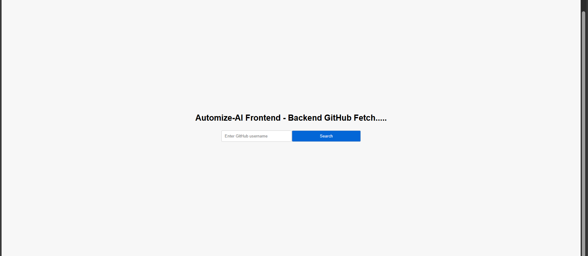

#Here following as Frontend code structure :-

Project-root
      Frontend 
        Public
          index.jsx
        Src
            Components 
                Userfollowers.jsx
                Userform.jsx
                UserRepositories.jsx
            Pages
                FollowersList.jsx
                RepositoryDetails.jsx
            App.jsx
            Index.jsx
            Styles.css
        .gitignore
        pakage-lock.json
        package.json

# The frontend code implemented as following requirement :-

FRONTEND 
Requirements: 
1. An initial page with a input box that accepts a GitHub username and a submit/search button 
2. On submit, show the list of repositories returned from above API (See image 1) for the username entered in the input box. Display some useful user info above the repository list. (Design not given in image1)
3. Clicking on any of the repositories should take us to a page which shows description about that repository (See image 2) 
4. Also on the repository list page near the user info, add a button / link that should lead to a page with followers of the current user. (Design not given, you are free to choose any simple design or you may follow a design similar to the repository list) 
5. Clicking on any follower should display the repository list page of that user 6. Also there has to be a way to go back to the repository list page with the input box 
Important Notes: 
1. Use only React hooks to build the app. 
2. You may use Redux or store everything in React, structure your code appropriately 3. For any images use owner.avatar_url 
4. Don’t call the GitHub API again for any information you already have. Eg. Do not make 5. API call again in the repository details page. Do not make API call again to get 6. repositories or followers info for a user if that info has already been fetched earlier for 7. that user. 
8. For the pages with design images given, try to style it as close as possible to the given 9. images in terms of layout and presentation but beautification is not important 10. Do not use any CSS/UI frameworks 
11. You do not need to manage browser history i.e all the pages can be on the same url 12. Submit the code by pushing repository to GitHub or any hosting platform of your choice. 13. Maintaining a reasonable commit history is recommended. 

UI - Homepage 

UI - render after search

UI - render after search ; when username is wrong input 

